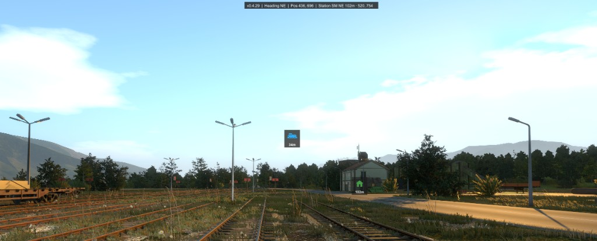
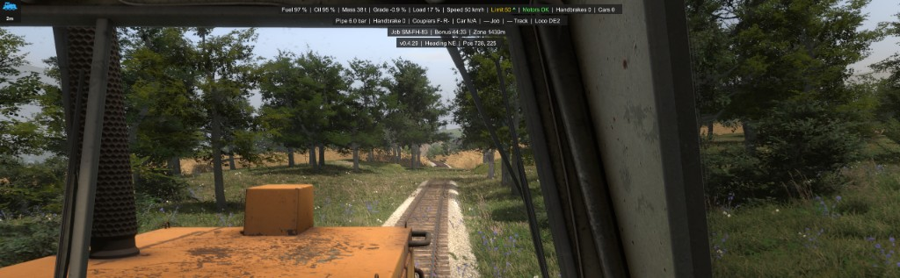
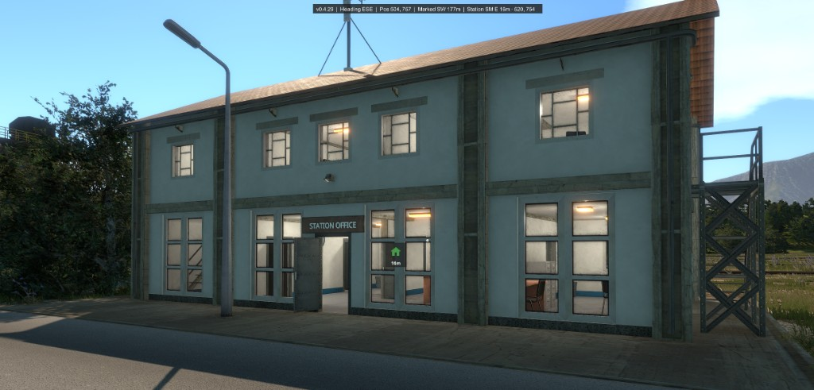
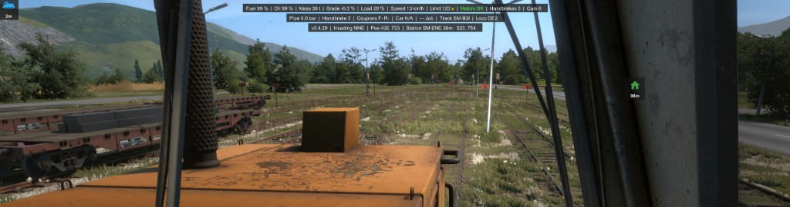
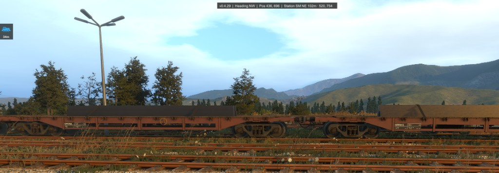

# UX / smoke feedback — Epic 4 AR + HUD (v0.4.29)

**Recorded:** 2026-07-23  
**Build tested:** `v0.4.29`  
**Source:** player smoke checklist + screenshots  
**Rule:** fix in **small slices** (one theme per ship). No big-bang rewrite.  
**Ship order:** **B → A → C → D** (clutter diet before AR math; job/preview truth last). See table below.

Screenshots live in [`ux-smoke-2026-07-23/`](ux-smoke-2026-07-23/).

---

## Smoke scorecard (this session)

| # | Topic | Result |
|---|--------|--------|
| 1 | Version chip `v0.4.29` | **PASS** |
| 2 | Mod Active / clean load | **PASS** |
| 3 | Loco AR icon after leaving loco | **PASS** (when ahead) |
| 4 | Behind-camera / compass placement | **FAIL** — see Bundle A |
| 5 | House icon leave/enter zone | **PASS** |
| 6 | House → office (not mid-yard cargo) | **PASS** |
| 7 | Pin (`Home`) | **PASS** (same behind-bug as #4) |
| 8 | `Shift+Home` clears pin | **PASS** |
| 9 | Leave zone → house gone | **PASS** |
| 10 | Track ID on look-at | **PASS** |
| 11 | Mainline / yard-only clutter | **FAIL** — see Bundle B |
| 12 | Station chip only in zone | **PASS** (keep; trim overload — Bundle B) |
| 13 | Station chip in zone | **PASS** |
| 14 | “At station / here” proximity | **FAIL** — see Bundle C |
| 15 | No job bar when no jobs | **PASS** |
| 16 | Job bar on take | **PASS** |
| 17 | Zone meters + cancelled / preview-prep | **Needs UX fix** — see Bundle D (remove Zone on taken; Preview edge for pre-validate) |
| 18 | Complete delivery / clear job bar | **DEFER** |
| 19 | No `Next:` when fluids OK | **PASS** |
| 20–21 | Fluids-low Next station | **DEFER** (debug fluids later) |
| 22–24 | Load colors / MU / Empty Cargo | **DEFER** |

**Extra product asks (this session):** remove **`Pos`**; hide house when **inside station**; hide loco icon when **inside loco**; AR markers **sticky under HUD** (with optional on-object duplicate when in sight); **no Monitor HUD on launcher** (no `v… | — Heading` outside world session).

---

## Agent remarks (bugs / confusion you may not have labeled)

1. **Behind-camera flip is broken for every marker** (loco, house, pin) — not loco-only. When the target is behind you, icons appear **in front** instead of on the left/right edge.  
   Evidence: heading **SSW** while Marked **NNE** / Station **NE** icons sit in the middle of the view.  
   

2. **`Zone 1711m` on a taken job is the wrong product story.**  
   Math is “radius − distance from station center” using `destroyGeneratedJobsSqrDistanceAnyJobTaken`, but that edge only expires **`availableJobs`** (unclaimed table/previews). **Taken jobs are not cancelled by leaving it.** Showing ~1.7 km on a validated job bar causes false anxiety and does not explain “died just outside the lines.”  
   

   **Player workflow that *does* lose jobs early (intentional):** prep/shunt cars **before** validating the preview, to start the bonus clock later. While the ticket is still a preview, leaving the tighter `destroyGeneratedJobsSqrDistanceRegular` (no taken job) wipes unclaimed jobs — cars/preview go useless. That is the “outside the lines” kill; Bundle D must cover it, not fake Cancelled on the big AnyJobTaken bubble.

3. **`— Track` on mainline is clutter**, same class as showing empty yard chips. Prefer **omit** the Track segment off yard tracks (not a dash placeholder).

4. **Standing at / inside Station Office still shows 16m / 3m** — office anchor is inside or offset; **`here` threshold is 1 m**, which is building-hostile.  
     
   

5. **In-cab loco icon at 2m** is noise once you’re already in that loco.  
   

6. **Text Station chip + house icon duplicate** the same story (id + meters). After AR is trustworthy, slim the always-on text (keep zone id; drop coords / long bearings if icon carries direction).

7. **World Y float** (icons ride up/down with look pitch) fights foot navigation. Sticky under-HUD row fixes the “watch heading + floating icons” problem better than more compass text.

8. **Good news from pics:** office house can align with the real Station Office building; Track IDs look right; job bar appears; version chip is correct.  
   

---

## Combined fix bundles (hit these 1-by-1)

### Bundle A — AR compass correctness + layout  
**Stories:** **4.9** follow-ups · smoke #4/#7 (PM: [PM_PLAN.md](../../PM_PLAN.md) Epic 4)  
**Problem:** Behind-camera projection wrong; icons roam vertically; too much clutter when already at the target.  
**Ship rule:** one step per branch (same as Bundle B); smoke PASS before the next step. **Do not** land A.1–A.4 in one uncommitted pile.

**Epic link:** Bundle A is presentation/fix follow-up on shipped **4.9** AR markers (baseline already on `main`). It does **not** open new Epic 4 stories; it closes smoke FAILs against 4.9. Proximity hide for the house icon (**A.4**) shares the office “here” radius with **Bundle C** (4.6) — implement A.4 hide with a provisional radius or stub, then tune radius in C; or land A.4 hide after C if hide needs the final radius (prefer provisional ~15–25 m in A.4 so A can smoke independently).

**Steps (separate ships):**
1. **A.1 Behind-camera edge** — markers clamp to the **correct** screen edge (turn cue), never fake center. Pure math in `ArMarkerProjection` (+ tests); wire `ArWaypointOverlay`. **PASS @ v0.4.37.**
2. **A.2 Sticky marker row** — horizontal compass strip under the lowest HUD bar; ahead → centered in row; aside/behind → matching row edge. Y = bottom of last visible HUD bar + gap.
3. **A.3 On-object ghost** — if target is in frustum ahead, also draw icon at world projection (duplicate). Sticky row always on.
4. **A.4 Proximity hide** — no loco icon while player is in that loco; no house icon while within office “here” radius (align with Bundle C; start ~15–25 m XZ if C not done).

**Out of scope until later:** distance fading polish, new art; Heading text removal (wait until A feels good); Bundle C office chip `here` wording (C’s ship).

**A done when:** A.1–A.4 smoke PASS — behind → sticky-row edge (not center); looking at loco → centered under HUD **and** on-object ghost; in-cab / in-office hides self-marker.

---

### Bundle B — Always-on / yard clutter diet  
**Stories:** 1.13 / 4.4 / 4.6 presentation  
**Problem:** Info overload; mainland still shows yard placeholders.  
**Ship rule:** one step per branch; smoke PASS before the next step.

**Steps (separate ships):**
1. **B.1 Remove `Pos`** — always-on bar drops Pos (keep Heading). Also hug bar width to content (no 280px floor). Version **v0.4.31**.
2. **B.2 Station coords** — keep yard id + short distance; drop map coords (`520, 754`). Version **v0.4.32**.
3. **B.3 Track omit** — omit Track segment when unknown / mainline / generic (no `— Track`). Version **v0.4.33**.
4. **B.4 Audit** — other yard-only empties: prefer omit over `— Word`. **v0.4.36:** omit `— Job` when the looked-at / standing car has no job (same class as Track). Kept: Pipe/Handbrake/Couplers (always meaningful on a car); `Empty Cargo` (real empty state); `Car N/A` on locos.

**Out of scope:** Heading removal until Bundle A feels good in play.

**B.1 smoke (v0.4.31):** always-on shows `v… | Heading …` (+ Marked/Station if any) and **never** a `Pos` chip; bar width hugs text (no empty right pad).  
**B.2 smoke (v0.4.32):** in-zone Station chip is `Station SM NE 84m` / `Station SM here` — **no** raw map coords.  
**B.3 smoke (v0.4.33):** on mainline / unknown track, second bar has **no** Track segment (not `— Track`); yard ID still shows `Track SM-O6I`.  
**In-world HUD (v0.4.34):** launcher / menus show **no** Monitor bars (no `v… | — Heading`).  
**No HUD version (v0.4.35):** always-on has Heading (+ Marked/Station) only — **no** `v…` chip; confirm ship # in Mod Manager.  
**B.4 smoke (v0.4.36):** second bar has **no** `— Job` when the car/loco has no job; real `Job SM-…` still shows.

---

### Bundle C — “I’m at the office” radius  
**Stories:** 4.6 / 4.9 proximity · smoke #14  

**Thoughts:** Exact XZ to an interior transform will never read as “here” when you’re on the sidewalk or in the lobby. Use a **radius**, not a 1 m point.

**Do (one ship):**
1. Raise office “here” / hide-icon radius (start ~**15–25 m** flat XZ; tune in smoke).
2. Station text chip: show **`Station SM here`** (no meters/coords) inside that radius.
3. Hide house AR icon inside that radius (ties to Bundle A.4).
4. If still wrong at the door, retarget office anchor to `JobValidator` / booklet spawn after this radius lands.

---

### Bundle D — Active job truth + preview-prep edge  
**Stories:** 4.8 · smoke #17  

**Backend (verified):** leaving destroy zone → `ExpireAllAvailableJobsInStation` on **`availableJobs` only**. Taken jobs cancel via abandon/trash booklet / Comms Radio delete / car fell-through-world — **not** by distance.

**Player need:** bonus-prep workflow = shunt/stage cars **before** validator so the bonus clock starts late. That leaves a live preview at risk of the **tight Regular** destroy edge. HUD must warn for that; must **not** imply a taken job dies at ~1.7 km.

**Do (one ship):**
1. **Taken job bar:** `Job … · Bonus …` only — **remove** Zone/Keep meters from validated/taken jobs (they lie).
2. **Cancelled:** when taken job state flips Abandoned/Expired (API), flash bar **red** + **`Cancelled`** (do not invent Cancelled from walking past AnyJobTaken).
3. **Preview / prep danger (the real early-kill):** while in a station zone with **available** (unvalidated) jobs and **no** taken job — show meters remaining to `destroyGeneratedJobsSqrDistanceRegular`, labeled clearly (e.g. **`Preview 180m`** / **`Avail`**), warn colors near the edge, **`OUT`** when past it. That matches prep-before-validate.
4. Optional same ship: if overviews are detectable in inventory, prefer gating the Preview chip on “holding a preview” rather than “any availableJobs”; otherwise availableJobs + no taken is the fail-closed proxy.

**Defer:** full delivery smoke (#18).

---

### Bundle E — Deferred (do not start until A–D settle)
- Fluids-low **Next:** station (#20–21) — needs debug fluid inject or long play.
- Load yellow/red (#22), MU coupler yellow (#23), Empty Cargo wording (#24).
- Delivery clears job bar (#18).

---

## Suggested ship order

| Order | Bundle | Why this order |
|------:|--------|----------------|
| 1 | **B** | Fast clutter diet (`Pos`, Track omit, station coords) — clean canvas before AR tuning |
| 2 | **A** | Hard AR math (behind-camera + sticky row); easier to verify on a quiet HUD — **ship A.1→A.4 one-by-one** |
| 3 | **C** | Needs clean Station chip (B) + trustworthy house marker (A) to judge `here` / hide |
| 4 | **D** | Job-state / preview-edge — independent of foot nav once A–C feel good |
| 5 | **E** | Deferred playtests |

Each bundle = own version bump + deploy + short smoke; then commit after PASS.

---

## Acceptance sketches (per bundle)

**B done when:** always-on has no `Pos`; mainline second bar has no Track segment; in-zone Station chip has no raw coords; no `— Job` when the car has no job. **PASS** through **v0.4.36**.

**A done when:** A.1–A.4 smoke PASS — behind → sticky-row edge (not center); looking at loco → centered under HUD **and** on-object ghost; in-cab / in-office hides self-marker.

**C done when:** standing at Station Office door / inside lobby shows `here` (or hidden house), not 16 m.

**D done when:** taken job bar has Job + Bonus only (no ~1700 m Zone); Abandoned/Expired → red Cancelled; while prepping unvalidated jobs, Preview/Avail meters track the **tight** Regular edge (not AnyJobTaken).

---

## Notes for implementers

- Sticky row Y = bottom of last visible HUD bar + gap (reuse `MonitorHudDriver` stack end).
- Behind-camera: prefer camera-forward rejection + **atan2** direction in view plane → edge point; don’t trust naive `Screen.width - x` alone on Unity `WorldToScreenPoint` behind hits.
- Bundle D APIs: `StationJobGenerationRange` (Regular vs AnyJobTaken), `Station.availableJobs` / `takenJobs`, `Job` Abandoned/Expired events — not “rename Zone.”
- Hide rules: `PlayerManager.Car == LastLoco` (or seated in loco) → no loco marker; office radius → no house marker.
